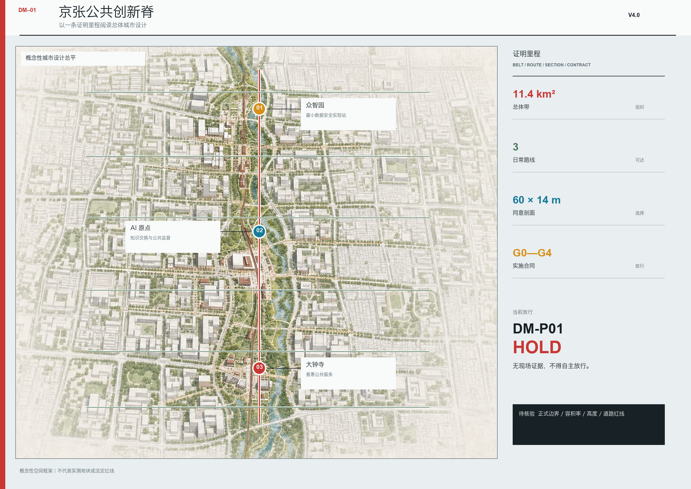
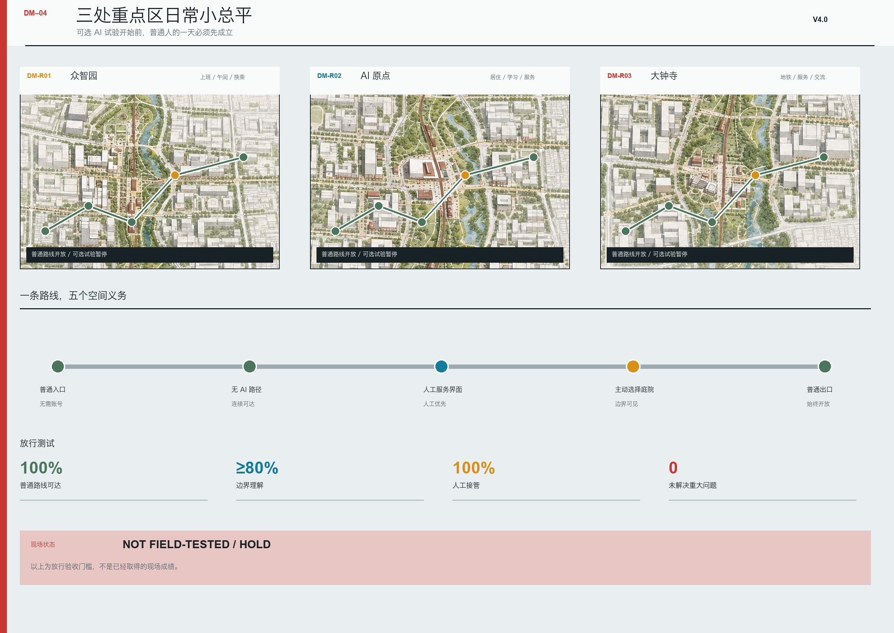
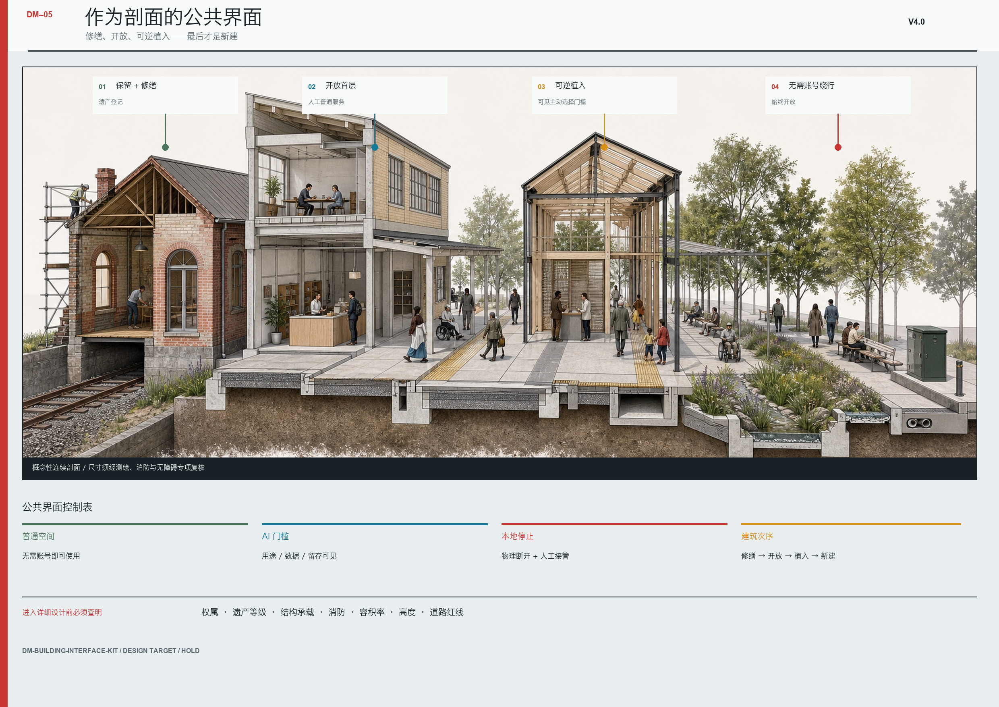

# 京张双记 / DOUBLE MEMORY JINGZHANG

> **v4.0 核心判断：** 城市设计必须同时经得起空间阅读与证据追问。新版以细颗粒街区肌理、京张公共创新脊、六组东西缝合、三处重点区日常小总平和连续公共界面剖面，承载“总体带—日常路线—同意剖面—实施合同”这条证明里程；所有法定控制仍保持 `unknown`，现场结果仍为 `not_field_tested / HOLD`。

| 评审维度 | v4.0 的实质深化 | 核验入口 |
| --- | --- | --- |
| 任务契合与原创性 | “证明里程”把公共记忆脊、日常路线、记忆边界护照和实施闸门组织成一条可追读的方法 | `proof-mile-spatial-atlas.json` |
| AI 与规划创新 | AI 不再是设备清单，而是受 D0—D4 数据等级、删除回执、物理停止和独立复核约束的城市服务 | `forgetfulness-budget.json`、离线审计脚本 |
| 实施可行性 | 建筑界面按“保留—轻改—可逆植入—法定控制明确后才新建”排序，并与 0—180 天闸门对接 | `building-interface-kit.json`、`implementation-contract.json` |
| 公共利益 | 三个重点区分别形成无需账号、保留普通等价服务的日常路线，由六类人物逐路线测试 | `key-area-daily-routes.json` |
| 风险与表达 | 总图与控制账本把 known、design_target、unknown、HOLD 分层显示，避免图面精度掩盖证据缺口 | 第 1、3—5 张展板、空间审计脚本 |

## 设计依据与资料清单

京张双记提出一个清晰判断：城市需要长期保存共同历史，但不应无限保存个人日常轨迹。方案把京张铁路工程自主、中关村知识进入社会、城市智能由人最终决定这三次能力跃迁连成一条公共发展主线，并把“知情、选择、中止申诉、共享收益”四项权利落实为空间界面和运营规则。[source:OFFICIAL-ANNOUNCEMENT] [source:JINGZHANG-HERITAGE] [depth:existing_conditions_diagnosis]

本方案依据官方征集公告、面向智能体任务书、仓库场地包与专业标准库生成。[source:SITE-PACKAGE] [source:SOURCE-REGISTRY] 总体设计范围与三处重点区当前使用仓库临时粗略多边形，仅用于方案生成、图面解释与机器自检，不是官方红线、法定控规或地块拆改依据。官方 polygon 发布后，全部九个 GeoJSON 图层、面积指标、图纸和 HTML 必须统一重算。[source:BOUNDARY-SOURCE] [data:geometry/site_boundary.geojson#SITE-001]

资料分为三类：官方公告和政策支撑任务、方向与合规判断；仓库处理资料作为检索导航而非新权威；历史、人口、社区与国际案例只支撑人文、运营和机制设计，不升级为法定空间控制。[source:PROCESSED-FACT-PACK] [source:HAIDIAN-STATISTICS] [source:GLOBAL-CASES]

三张影像分别作为工程历史、铁路日常生活与遗产再利用的视觉证据；许可、作者、原始页面和改动说明登记在来源与版权文件中。[source:IMAGE-JINGZHANG-1909] [source:IMAGE-QHY-2016] [source:IMAGE-QHY-2024]

## 三层范围工作框架

统筹研究范围回答产业与公共价值如何协同；总体设计范围回答一条约九公里廊道如何南北贯通、东西缝合；三处重点区域回答制度原型如何进入具体公共空间、建筑更新、慢行与运营场景。三层以“一脊、三站、两翼、三种同意梯度”传导，而不是形成三套互不相干的图纸。[standard:PROJECT-OFFICIAL-ANNOUNCEMENT] [depth:three_level_scope_framework]

| 层级 | 核心问题 | 双记回答 | 证据落点 |
| --- | --- | --- | --- |
| 统筹研究范围 | 世界级 AI 创新生态为何服务公共利益 | 知识策源、成果转化、公共试验、规则输出形成闭环 | compliance_matrix.json |
| 总体设计范围 | 产业、生活、遗产、公园如何连成城市 | 公共记忆脊连接校园、园区、街区、社区 | [data:geometry/land_use.geojson#LU-001] |
| 重点区域 | 试验如何可见、可退、可复核 | 三个“人掌舵”城市实验站 | [data:geometry/key_areas.geojson#PROV-KEY-001] |

临时总体范围复算面积为 11,412,825.386 平方米；该值只描述提交几何，不代表官方审定面积。[metric:site_area_sqm] 三处临时重点区数量为 3，位置和形状均待官方边界复核。[metric:key_area_count]

## 统筹研究范围产业与未来城市研究

### 三次自主能力跃迁

1909 年京张铁路完成工程自主；改革开放后的中关村形成知识、市场与社会协同的创新能力；面向未来，城市自主意味着人能够理解、授权、中止和审查 AI 行动。新的创新带不以设备数量或屏幕密度衡量先进性，而以公共问题是否解决、技术是否可退出、责任是否可追溯衡量。[source:ZHONGGUANCUN-HISTORY] [source:BEIJING-AI-POLICY]

### 五段创新链

高校和科研机构提出可验证知识，开源社区形成协作资产，企业完成产品化，社区和公共空间开展受控试验，专业服务与公共审查形成复盘。两翼为这条链提供不同输入：

- 中关村科技服务翼提供法律、知识产权、模型安全、开源、融资和国际标准服务；
- 小月河生活场景翼从养老、儿童、无障碍、生态、通勤与夜间安全提出真实需求；
- 每个项目必须由一项真实需求、一个责任主体、一处试验空间和一套退出机制构成。

未来形态不是封闭园区，而是校园、园区、街区、社区共享地面层的“可穿行创新城区”。首层公共前场、无围墙绿地、慢行连接和线下服务共同构成创新基础设施。[source:HAIDIAN-RENEWAL-GUIDE] [standard:MOHURD-URBAN-DESIGN-MEASURES] [depth:overall_spatial_structure]

## 总体设计范围城市更新与控规深度城市设计

空间结构由一条公共记忆脊、三个实验站、两翼协作网络和三类同意空间组成。公园绿地与开敞空间、AI 研发创新、产业商业服务、社区服务四类功能分区完整覆盖临时边界；这是一种概念分配方法，不是法定用地变更。[data:geometry/land_use.geojson#LU-001] [depth:land_use_layout]

用地更新采用四类动作：

1. 保留铁路遗产、成熟社区结构和有持续使用价值的建筑；
2. 改造封闭首层、闲置厂房和低效办公，使其承担公共学习、试验和企业服务；
3. 拆除只在完成权属、结构、安全、文保和居民协商后提出；
4. 新建优先补足无障碍、养老、青年居住、公共厕所、端侧算力与能源设施。

当前建筑图层表达设计性更新基底 310,807.184 平方米，但不构成拆改留审批结论。[data:geometry/buildings.geojson#BLDG-001] [metric:building_footprint_area_sqm] 容积率、建筑高度、道路红线、退界、市政容量均保持 unknown，待正式控规和工程资料确认。[depth:development_intensity_controls]

### 三种同意梯度

| 等级 | 空间原型 | 数据规则 | 使用者权利 |
| --- | --- | --- | --- |
| 白色：无 AI 公共地带 | 林荫道、座椅、饮水、厕所、普通导视 | 不做人脸与个体轨迹识别 | 无需账号即可使用 |
| 蓝色：匿名辅助地带 | 客流疏导、环境监测、无障碍提示 | 边缘处理、聚合输出、最短留存 | 可见告知，可选择非智能替代 |
| 琥珀色：受控试验地带 | 机器人、自动驾驶、交互模型测试 | 明示授权、目的限定、审计记录 | 可退出、可中止、有人类监督 |

三种梯度通过同一套现场语言表达：白色圆点表示自由通行，蓝色脉冲表示匿名辅助，琥珀色边框表示正在试验；绿/黄/红灯态分别表示正常、受限和停止。

v2.0 将抽象梯度压成一个可异地复用、现场再校准的 60 米 × 14 米原型包络：4.0 米连续无 AI 步行带、2.5 米匿名辅助带、5.0 米受控试验庭与 2.5 米种植安全缓冲。尺寸不是地块控制，而是进入专业测量前的最低功能检验；无障碍净宽任何时点不得低于 1.8 米。传感器必须外露，端侧柜可断电，试验庭有物理急停和有人值守控制台，公众绕行不经过试验区。完整构造、责任、数据和停止条件见 `visual/assets/memory-boundary-passports.json`。[depth:traffic_rail_slow_parking]

### 记忆边界护照与遗忘预算

每张护照同时回答八个问题：落在哪里、占多大、谁负责、记录什么、保留多久、普通服务如何继续、什么情况停机、用什么证据决定保留/返修/退役。三张护照当前统一为 `hold`，只有责任主体、普通等价路径、数据告知、急停接管、投诉删除渠道和独立无障碍走查全部有证据时，才可进入 `limited_release`。

“遗忘预算”把数据分为 D0—D4：普通匿名使用零采集；聚合环境数据最长 90 天；自愿服务会话 0—7 天；受控试验事件 30 天；已清权的公共贡献按明示档期保存并可撤回。公共记忆可以在权利清楚时累积，但个人轨迹默认到期。任何字段超出护照、删除任务失败或删除回执不可验证，都冻结采集并恢复普通服务。规则见 `visual/assets/forgetfulness-budget.json`。[source:PIPL]

## 重点区域详细设计

### 众智园：安全与最小数据实验站

以清河公共界面、全栈自主技术和安全治理为重点。绿色公共空间承载机器人与模型的受控测试；每个测试点显示运营者、用途、数据类型、留存期、风险等级和停止按钮。优先使用合成数据、端侧计算与匿名统计。清河生态、防洪和道路条件未取得前，只提出可逆设施与运营原型。[data:geometry/key_areas.geojson#PROV-KEY-001] [depth:three_key_area_detailed_design]

### 北京 AI 原点社区：知识交换与公共监督实验站

以校园—园区—社区首层开放为核心，设置城市 AI 登记册、AI 来源诊所、开源贡献墙、社区问题发布台和成果转化服务。居民故事与开源贡献可署名、修订和撤回；试验结果同时公开成功、失败与停止记录。[data:geometry/key_areas.geojson#PROV-KEY-002] [source:AI-ORIGIN-COMMUNITY]

### 大钟寺：普惠服务与国际交流实验站

以站城步行连接、无账号公共服务、多语言交流、智能终端和内容消费为重点。导航、翻译、办事与无障碍辅助均保留人工、纸质或电话等价渠道。仓库临时大钟寺 polygon 存在空间偏移风险，本版不据此判断具体地块、路口和建筑。[data:geometry/key_areas.geojson#PROV-KEY-003] [source:DAZHONGSI-RENEWAL] [assumption:A-KEYAREA-002]

三个重点区均采用“保留—轻改—可逆试验—审查扩展”路径；具体建筑规模、拆改和工程线位须待官方边界、权属和现场调查确认。

v4.0 将三条路线落到三张项目绑定的小总平：众智园为“上班—午间休憩—公交换乘”，AI 原点为“居住—学习—社区服务”，大钟寺为“地铁换乘—普惠服务—国际交流”。每条路线均从普通入口开始，以无需账号的无 AI 路径作为底线，只有主动选择后才进入辅助或测试空间，并始终保留人工服务与普通出口。图中街区肌理属于概念表达，路线是 `design_target`，尚未经过现场踏勘与使用者测试。[depth:key_area_urban_design]

## AI 创新生态、人才画像与 AI+ 场景

方案用六类人物检验公平性：长期居民及照护者、高校师生、初创团队与科研人员、一线服务劳动者、跨区通勤者及短暂停留者、外籍及残障使用者。北航社区老龄人口结构说明，未来城市必须保留线下服务和非 AI 选择，而不能假设所有人愿意或能够使用智能终端。[source:BEIHANG-ELDERLY-COMMUNITY]

十二个场景形成“服务—数据—人工兜底”闭环：

| 编号 | 场景 | 空间载体 | 最小治理条件 |
| --- | --- | --- | --- |
| 01 | 无账号漫步 | 公共记忆脊 | 基本服务不要求注册 |
| 02 | 零留存多语导览 | 大钟寺、遗产节点 | 端侧处理，会话后清除 |
| 03 | 无障碍需求热图 | 蓝色辅助区 | 只统计设施问题 |
| 04 | 边缘客流预警 | 轨道接驳节点 | 不上传原始视频 |
| 05 | 儿童双重同意沙盒 | 受控试验区 | 儿童与监护人同意 |
| 06 | 长者线下等价服务台 | 社区服务节点 | 人工、纸质、电话并存 |
| 07 | 可撤回贡献墙 | AI 原点社区 | 可修订、撤回、留异议 |
| 08 | AI 来源诊所 | AI 原点社区 | 展示来源、限制、责任人 |
| 09 | 共同记忆校验桌 | 清华园站等遗产点 | 多方验证，保留分歧 |
| 10 | 删除回执终端 | 三个实验站 | 删除后提供可验证回执 |
| 11 | 企业最小数据试验台 | 众智园 | 优先合成和匿名数据 |
| 12 | 自动过期活动凭证 | 全带活动节点 | 活动结束权限自动失效 |

每个场景必须登记运营者、使用者、数据、留存期、人工兜底、停止条件和试验后证据。至少 03、04、05、10、11 属于可审计的产业测试验证场景。[source:PIPL] [source:CAC-AGENT-GOVERNANCE]

v2.0 增加六类人物路线测试，而不是只做需求画像：无智能手机长者、轮椅使用者、盲杖/导盲犬使用者、带儿童家长、夜班服务劳动者和中文有限的国际访客，必须分别完成通行、理解、人工接管和申诉。普通路线完成率、人工接管成功率均须为 100%，关键信息理解率至少 80%，且任何组不得有未解决关键问题；未达标即 `HOLD`。这些数值是试点放行阈值，不是现状成绩，当前状态为 `not_run`。详见 `visual/assets/public-interest-route-tests.json`。

三处公共地标不是纪念性大物体，而是可使用的治理界面：清华园“共同记忆站台”、原点社区“公共 AI 登记塔”、众智园“红灯试验庭”。它们共同形成全球 AI 参访路线，但其价值来自公开规则而非造型奇观。[standard:PROJECT-AGENT-OPEN-CALL-TASKBOOK]

## 用地、建筑规模与拆改留方案

临时用地结构将研发创新、产业商业、社区服务和绿地开敞空间组织为混合走廊，避免形成纯办公园区。完整功能覆盖由 land_use.geojson 表达；绿地设计面积为 1,408,600.768 平方米，占临时提交边界 12.3423%；公共空间设计面积为 836,345.643 平方米，占 7.3281%。这些是概念图层复算值，不是现状统计或控规指标。[metric:green_ratio] [metric:public_space_ratio]

建筑更新优先处理四种界面：封闭园区首层、轨道站口四象限、社区与园区交界、遗产与新建之间。保留对象以文化与持续使用价值为前提；改造对象以开放首层和复合服务为重点；拆除、新建、层数与高度不在缺少正式资料时作伪精确判断。[standard:MNR-LAND-USE-CLASSIFICATION-GUIDE] [depth:retain_renovate_demolish] [depth:height_massing_character]

## 交通、轨道、市政与公共服务设施

京张遗址公园构成南北慢行骨架，九条及以上东西向缝合路径连接高校、社区、园区与轨道站。五道口、清华东路西口、大钟寺及北五环跨越处优先布置无障碍连续性、非机动车停放、遮阴、夜间照明和人工服务。道路图层只表达概念廊道，不替代道路红线与交通工程设计。[data:geometry/roads.geojson#ROAD-001] [source:JINGZHANG-PARK] [depth:traffic_rail_slow_parking]

新型基础设施采用“端侧优先、能源可计量、设备可关闭、接口可替换”原则。端侧算力柜与传统市政设施共址，但不将个人敏感数据写入永久城市信息模型。雨洪、能源、消防、通信和管线容量均列为实施前置条件。[data:geometry/constraints.geojson#CONSTRAINTS] [depth:municipal_new_infrastructure]

## 蓝绿空间、公共空间与城市风貌

公共记忆脊以京张遗址公园为骨架，连接清河、小月河、校园绿地和社区口袋空间。蓝绿系统同时承担雨洪、热舒适、生物多样性、慢行与创新交往，不把公园变成设备展场。[data:geometry/green_space.geojson#GREEN-001] [data:geometry/public_space.geojson#PUBLIC-001] 任何传感器必须可见、说明用途、责任主体和开关状态。[source:AMSTERDAM-SENSING] [depth:blue_green_public_space]

风貌语言来自铁路工程的清晰构造、中关村开放协作和 AI 治理的可见状态：深轨红代表公共记忆，冷蓝代表匿名辅助，琥珀代表受控试验，纸白代表无 AI 公共地带。历史材料不被仿古复制，新设施保持轻量、可逆和可维护。

## 更新项目清单、实施政策与分期计划

### 0—180 天最小实施合同

实施不从采购 AI 设备开始，而从锁定事实和普通服务开始：0—30 天核对边界、权属、责任和现场基线；31—60 天先完成无障碍绕行、纸面导视、人工服务、座椅遮阴与饮水；61—90 天才安装可逆分区、端侧柜、物理急停与审计记录；91—120 天最多运行 20 个有人值守窗口，同时记录成功、失败、近失、投诉和删除回执；121—180 天由独立小组作保留、返修或退役决定。

三个原型与基线、运营和预备金的概念总成本区间为 750—1350 万元，其中首阶段至少 30%投向普通公共服务和无障碍，G3 前 AI 硬件不超过 25%，10%预备金留到独立复核后释放。该区间只用于比较实施量级，不是审定投资；官方边界、权属、文保、消防、交通、市政、树木土壤、数据影响评估、保险和维护责任缺一项，项目即停在相应闸门。完整 RACI 与退场规则见 `visual/assets/implementation-contract.json`。[depth:phasing_implementation]

| 编号 | 项目 | 首期动作 | 扩展前置条件 |
| --- | --- | --- | --- |
| DM-01 | 公共记忆脊 | 口述史、无账号导视、休息点 | 文保及现场调查 |
| DM-02 | 城市 AI 登记册 | 登记 3 个试验站系统 | 责任主体与审计制度 |
| DM-03 | 众智园红灯试验庭 | 可逆测试设施与停止按钮 | 安全、生态、交通评估 |
| DM-04 | 原点社区来源诊所 | 周末工作坊与开源台账 | 校园、园区、社区协议 |
| DM-05 | 大钟寺普惠服务台 | 人工与 AI 双通道 | 官方重点区和站城资料 |
| DM-06 | 东西慢行缝合 | 断点调查和临时标线 | 道路、权属、市政审批 |
| DM-07 | 公共收益账本 | 公开成本、受益与再投入 | 运营财务规则 |
| DM-08 | 年度“人掌舵”开放周 | 公开失败、召回、复盘 | 活动许可与安全预案 |

2026—2028 年以现场基线、登记册和可逆试验为主；2028—2030 年只扩展通过安全、公平、可达和居民接受度审查的组件；2030 年后输出开放标准并保持年度复审、召回与退役机制。[data:geometry/phasing.geojson#PHASE-001] [source:HAIDIAN-FIVE-YEAR-PLAN] [depth:phasing_implementation]

运营采用“四本账”：系统登记账、个人授权账、公共收益账、失败退役账。年度活动由社区议题征集、测试开放日、国际标准工作坊和公开复盘组成；不把尚未确定的活动写成政府承诺。[depth:renewal_project_list]

## 指标体系、面积复算与合规矩阵

已知指标只来自提交几何或可数清单：临时边界面积、三处重点区数量、建筑基底、绿地与公共空间比例、十二个场景、六类人物和八个更新项目。容积率、高度、道路红线、市政容量、投资和工期均保持待确认。metrics.json 保存计算公式与来源文件，compliance_matrix.json 将公告和 agent.1—agent.6 映射到章节、图层、图纸、来源和自检项。[depth:metrics_recalculation]

四项权利采用可检查目标：

- 知情权：所有公共 AI 系统登记用途、责任人、数据与投诉渠道；
- 选择权：所有基本公共服务保留非 AI 等价渠道；
- 中止申诉权：高风险试验具备物理停止、人工接管和公开响应时限；
- 公共收益权：每项试验公开成本、受益人群、节省资源与再投入方向。

没有现场基线时，这些只能写成目标与测量协议，不能写成已实现绩效。

包内提供两项无外部依赖的结构审计：`node visual/assets/run-memory-passport-audit.js` 与 `node visual/assets/run-spatial-atlas-audit.js`。当前回放均为 `PASS`：前者核对三张护照的责任、数据、普通等价、停止与放行决定；后者核对四级证明里程、三条日常路线、无账号等价服务、现场未测试状态和法定控制缺口。两项 `PASS` 都只证明材料结构完整，不证明空间已建成、系统安全、公众接受或取得许可。

## 风险、版权与合规说明

六条停止规则构成本方案的硬边界：

1. 没有官方边界，不作地块级强结论；
2. 没有现场基线，不宣称改善百分比；
3. 没有责任主体，不部署；
4. 没有人工或非 AI 等价渠道，不进入基本公共服务；
5. 没有停止条件，不开展公共空间试验；
6. 没有居民参与证据，不以“共创”命名。

重点风险包括临时边界偏移、缺少现状建筑与权属、道路市政与文保资料不足、居民参与尚未开展、运营责任与资金未确定。它们分别进入 assumptions.json 与约束清单，不能被图面精度掩盖。[assumption:A-CONTROLS-001] [assumption:A-FIELDWORK-001] [depth:risk_missing_data]

方案遵守数据最小化、目的限定、最短留存、个人查询更正删除、人工最终决定与授权边界原则。[source:PIPL] [source:CAC-AGENT-GOVERNANCE] 所有图件由本方案的 GeoJSON、指标与原创信息设计生成，不使用远程地图瓦片、未清权截图、企业商标或第三方生成图像。详细许可见 report/copyright_statement.md。

## 参考资料

资料体系服务于“可读论证”和“机器复核”两个层次。官方征集公告、场地包和面向智能体任务书确定三层范围、必答任务与统一边界条款；京张铁路与清华园站校史资料支撑工程自主和共同记忆叙事；北京市与海淀区关于遗址公园、城市更新、人工智能、人口和养老的资料用于识别现实人群、公共空间方向和发展时序；个人信息保护与智能体治理规则用于定义最小采集、最短留存、人工最终决定和召回边界。[source:OFFICIAL-ANNOUNCEMENT] [source:JINGZHANG-HERITAGE] [source:PIPL]

赫尔辛基 AI Register、阿姆斯特丹 Responsible Sensing、榜鹅数字园区、Kendall Square 和巴黎 Rive Gauche 只提供登记、可见传感、开放地面层、遗产再利用和混合城市等可转化机制，不作为北京地块控制或建设标准。[source:GLOBAL-CASES] 所有空间面积仍以本包 GeoJSON 和 metrics.json 的复算关系为准；临时边界、现场基线、权属、市政、文保、运营责任与资金缺口在 assumptions.json 中持续披露。完整机器索引见 sources.json、standard_matrix.json、design_depth_matrix.json 和 compliance_matrix.json；正式多边形与现场证据补齐后，九个图层、指标、双语图件、PDF 和 HTML 必须作为同一版本整体更新。[depth:risk_missing_data] [metric:site_area_sqm]
